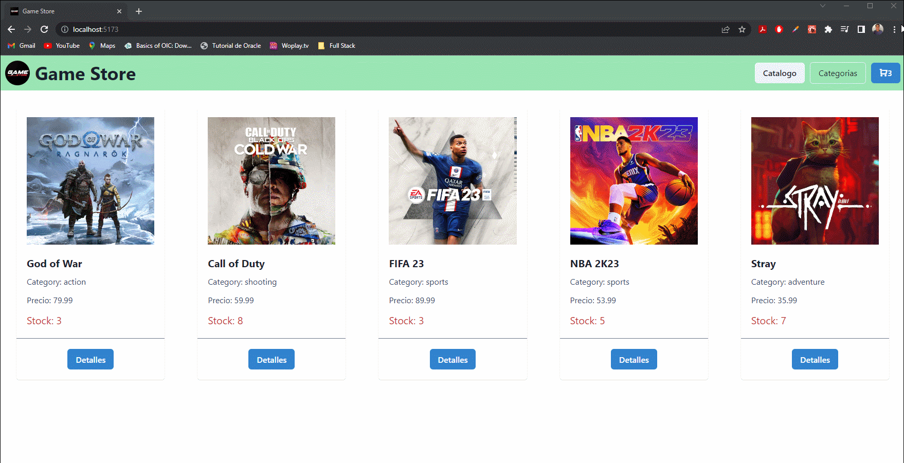

_Para porder realizar una correcta ejecucion y prueba del mismo, se debe descargar y abrir su contenido en un proyecto nuevo en VSCode. Posterior se debe ejecutar los siguientes comandos:_

```
npm install vite@latest
npm run dev
```

Una prueba de funcionamiento del mismo se puede visualizar en el siguiente GIF:



Muchas gracias.

| Nombres  | Apellidos |          Email          |

| Ezequiel | Reymundo  | ezequielrey2020@gmail.com
